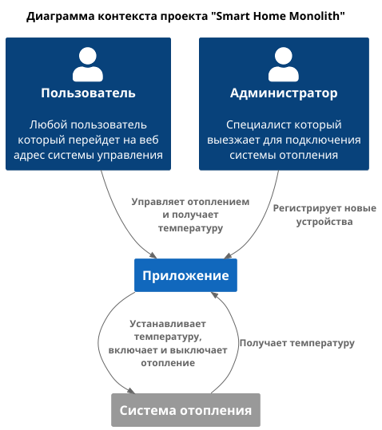

# Задание 1. Анализ и планирование

Проект "Smart Home Monolith" представляет собой монолитное приложение для управления отоплением и мониторинга температуры в умном доме. 

### 1. Описание функциональности монолитного приложения

**Управление отоплением:**

Пользователи могут:
- удаленно включать/выключать отопление
- устанавливать желаемую температуру
- просматривать текущую температуру через веб-интерфейс

**Мониторинг температуры:**

Пользователи могут:
- просматривать текущую температуру через веб-интерфейс

### 2. Анализ архитектуры монолитного приложения

Приложение написано на Java и использует базу данных PostgreSQL. 

Приложение запускается в Docker.

Приложение работает в синхронном режиме по HTTP и использует REST API на порту 8080

### 3. Определение доменов и границы контекстов

В приложении можно выделить 2 домена.
1. Мониторинг системы отопления
2. Управление системой отопления

### 4. Проблемы монолитного решения**

- Синхронная работа приложения
- Нет аутентификации пользователя
- Масштабирование, если добавлять больше различных датчиков, придется масштабировать весь монолит а не отдельные его части 
- Отказоустойчивость, при изменении одной части приложения, может произойти ошибка в другом, если не покрыть код хорошими тестами.

### 5. Визуализация контекста системы — диаграмма С4

[Диаграмма](diagrams/1_5_diagram.puml)

# Задание 2. Проектирование микросервисной архитектуры

Добавим новые домены в архитектуру:
1. Управление пользователями
   - Регистрация новых пользователей
   - Авторизация пользователей
2. Управление устройствами
   - Добавление новых устройств
   - Настройка устройств
   - Создание сценариев для автоматизации
3. Мониторинг
   - Сбор информации с устройств и аггрегация
   - Визуализация и вывод метрик

**Диаграмма контейнеров (Containers)**

Добавьте диаграмму.

**Диаграмма компонентов (Components)**

Добавьте диаграмму для каждого из выделенных микросервисов.

**Диаграмма кода (Code)**

Добавьте одну диаграмму или несколько.

# Задание 3. Разработка ER-диаграммы

Добавьте сюда ER-диаграмму. Она должна отражать ключевые сущности системы, их атрибуты и тип связей между ними.

Четвёртое задание — дополнительное. Его можно сделать по желанию. Чтобы ревьюер быстрее проверил ваше решение, укажите, сделали вы это задание или нет. Для этого оставьте нужный эмодзи около заголовка задания:

✅ — вы выполнили задание.

❌ — вы пропустили задание.

# ✅ ❌ Задание 4. Создание и документирование API

### 1. Тип API

Укажите, какой тип API вы будете использовать для взаимодействия микросервисов. Объясните своё решение.

### 2. Документация API

Здесь приложите ссылки на документацию API для микросервисов, которые вы спроектировали в первой части проектной работы. Для документирования используйте Swagger/OpenAPI или AsyncAPI.